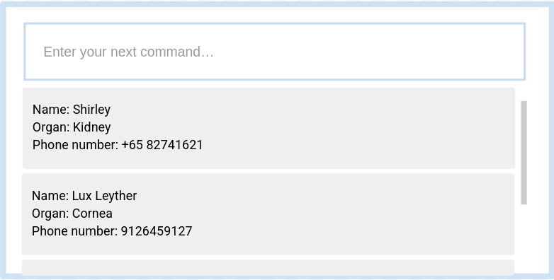

# Organ-izer

* This is a Recipient Registry Application for Organ Donor   Coordinators.

---
* Example usages:
  * To store patient data
  * To find suitable recipients quickly  
* It comes with a reasonable level of user and developer documentation.  
* For the detailed documentation of this project, see the [Address Book Product Website](https://ay2526s1-cs2103t-t17-3.github.io/tp/).  
This project is based on the AddressBook-Level3 project created by the [SE-EDU initiative](https://se-education.org/).

